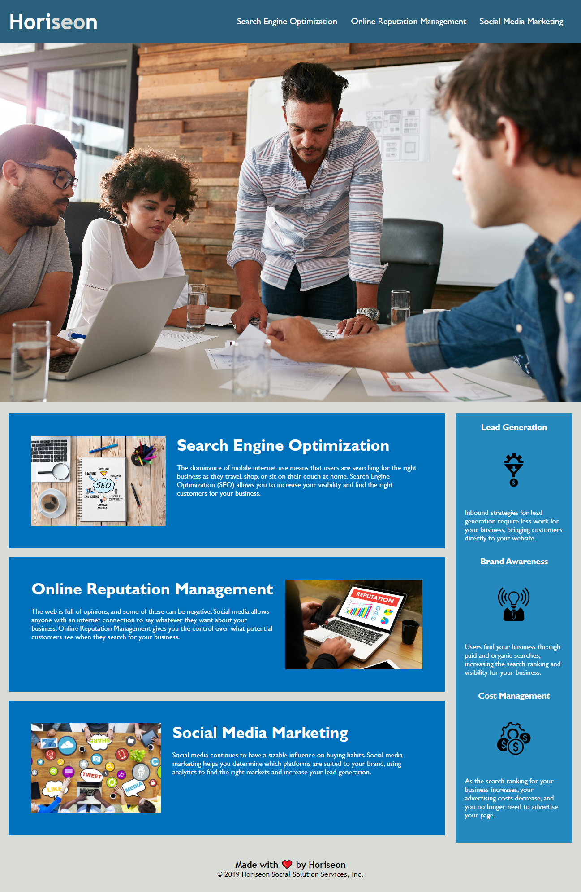

# Challenge Assignment - Week 1

## Description

The goal of the project was to help the Horiseon Social Solution Services organization to make their site more user accessible which will also help their SEO ranking.

- What was your motivation?
    - To prove that I have a strong understanding of the HTML semantic elements
    - To improve my understanding of site accessibility and practice writing of alt tags.
    - Continue to improve my understanding of the git workflow.
- What problem does it solve?
    - To improve the accessibility of the Horiseon's Social Solutions Services webpage so more users can consume these details. These changes will also help to improve its SEO ranking which can help to increase organic traffic while reducing their marketing costs.
- What did you learn?
  - A larger breath of the semantic tags for html.
  - Basic dos and don’ts for site accessibility.
  - How to create a sub-branch of main and to work within that branch to reserve the 'main' branch for the live environment.

## Usage

- You can navigate this page to get a better understanding of the various services that Horisoen Social Solutions Services offer.

- Below is a link to the webpage after the accessibility changes have been made.
    - This site can be access by going to:
        - https://garrettwinter.github.io/challengeAssignment-Week1/
    - 

## Credits

While working on this project I had collaborated in rea0ltime with:
  - Salahuddin Imdad (https://github.com/Sal8298).

## License

MIT License

Copyright (c) 2022 Garrett Winter

Permission is hereby granted, free of charge, to any person obtaining a copy
of this software and associated documentation files (the "Software"), to deal
in the Software without restriction, including without limitation the rights
to use, copy, modify, merge, publish, distribute, sublicense, and/or sell
copies of the Software, and to permit persons to whom the Software is
furnished to do so, subject to the following conditions:

The above copyright notice and this permission notice shall be included in all
copies or substantial portions of the Software.

THE SOFTWARE IS PROVIDED "AS IS", WITHOUT WARRANTY OF ANY KIND, EXPRESS OR
IMPLIED, INCLUDING BUT NOT LIMITED TO THE WARRANTIES OF MERCHANTABILITY,
FITNESS FOR A PARTICULAR PURPOSE AND NONINFRINGEMENT. IN NO EVENT SHALL THE
AUTHORS OR COPYRIGHT HOLDERS BE LIABLE FOR ANY CLAIM, DAMAGES OR OTHER
LIABILITY, WHETHER IN AN ACTION OF CONTRACT, TORT OR OTHERWISE, ARISING FROM,
OUT OF OR IN CONNECTION WITH THE SOFTWARE OR THE USE OR OTHER DEALINGS IN THE
SOFTWARE.

